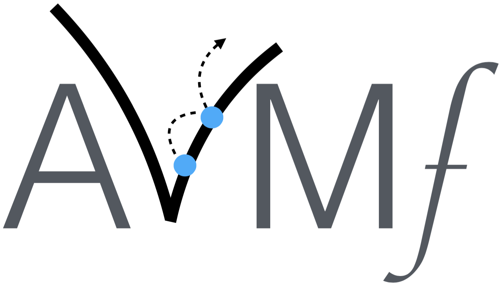

# Welcome to the AVMFramework (AVM<i>f</i>)

AVM<i>f</i> is a framework and Java implementation of the Alternating Variable Method (AVM), a heuristic local search algorithm that has been applied to several important software engineering problems.

Originally applied to automatic test input generation problems by Korel (1990), the AVM has since been extended to handle fixed point numbers (Harman and McMinn, 2007) and strings (McMinn et al., 2015), and enhanced with different local search algorithm that are proven to be faster under certain conditions (Kempka et al., 2015).

AVM<i>f</i> was designed to enable researchers and practitioners understand the algorithms behind the AVM and use it in their projects, and is freely available for use under the MIT licence.

## Downloading

You can download AVM<i>f</i> from GitHub: <https://github.com/AVMf/avmf>. Details on how to install the framework are provided in the project's README.md file.

## Paper

AVM<i>f</i> is further described in the SSBSE 2016 paper _"AVMf: An Open-Source Framework and Implementation of the Alternating Variable Method"_ (McMinn and Kapfhammer, 2016), which is <a href="http://philmcminn.staff.shef.ac.uk/publications/c43.html">available to read and download online</a>.

## BibTeX repository

We have also made a repository available containing a `.bib` file with details of publications that use the AVM in their research. You may clone this repository to cite these papers or copy and paste the relevant entries for your own work. The repository is available at: <https://github.com/AVMf/avm-bibliography>. Again, details on how to install the framework are provided in the project's README.md file.

If you wish to have your paper added to the repository `.bib` file, please get in touch with us using the provided linkes below.

## For more information

For more information, please contact the authors of the tool, [Phil McMinn](http://philmcminn.staff.shef.ac.uk) or [Gregory Kapfhammer](http://www.cs.allegheny.edu/sites/gkapfham/).

## References

- Phil McMinn and Gregory M. Kapfhammer.
AVMf: An Open-Source Framework and Implementation of the Alternating Variable Method.
International Symposium on Search-Based Software Engineering (SSBSE 2016), To Appear.
<a href="http://philmcminn.staff.shef.ac.uk/publications/c43.html">Available to read and download online.</a>

- Phil McMinn, Chris J. Wright and Gregory M. Kapfhammer.
The Effectiveness of Test Coverage Criteria for Relational Database Schema Integrity Constraints.
ACM Transactions on Software Engineering and Methodology, vol. 25, no. 1, pp. 8:1–8:49, 2015.
<a href="http://philmcminn.staff.shef.ac.uk/publications/j18.html">Available to read and download online.</a>

- Joseph Kempka, Phil McMinn and Dirk Sudholt.
Design and Analysis of Different Alternating Variable Searches for Search-Based Software Testing.
Theoretical Computer Science, vol. 605, pp. 1–20, 2015.
<a href="http://philmcminn.staff.shef.ac.uk/publications/j17.html">Available to read and download online.</a>

- Mark Harman and Phil McMinn.
A Theoretical and Empirical Analysis of Evolutionary Testing and Hill Climbing for Structural Test Data Generation.
International Symposium on Software Testing and Analysis (ISSTA 2007), pp. 73–83, 2007.
<a href="http://philmcminn.staff.shef.ac.uk/publications/j8.html">Available to read and download online.</a>

